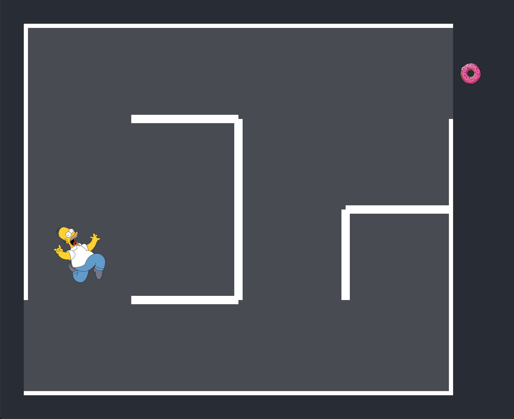

#  

Classroom project for an Artifial Intelligence class at University of Caxias do Sul, Brazil

This is not a generic implementation. In fact, this code can only solve the following (hardcoded) maze:



## Basic definitions
- Homer can try to walk six steps in one of the cardinal directions
- Each direction is composed of two bits, each bit being a gene
  bits | directions
  -----|------------
  00 | right
  01 | up
  10 | down
  11 | left
- Each attempt is an individual in the population, therefore each individual contains twelve genes

## Fitness function
This code expects the solution ```right, right, up, up, up, right```. On some tests, the algorithm has found another ways, such as ```up, up, up, right, right, right```. For each individual in a population, represented by Homer on the picture above, it's fitness is estimated considering the following rules:
- If Homer runs into a wall, he will not move (next direction will be evaluated considering the same position) and will receive a -50 punishment. 
- If Homer gets to the donut, he will receive a +100 reward.
- If Homer thinks of going in the same direction as expected, he will receive a +5 "tap in the back" reward. Both solution and individual are dissected into pairs of bits. For each pair, if both presents the same directions, the fitness of said individual is increased by 5. He can get a maximum of +30 points for this.
- If Homer might feel like maybe taking a certain path, which may be the same as expected, he will receive a +1 for trying. Both solution and individual are dissected into bits. For each bit, if both are equal, the fitness of said individual gets increased by 1. He can get a maximum of +12 points for this.
- Doing the math, global maximum is 142.

## Crossover
- Crossover is performed on 50% of the individuals (statistically approximated via random function). 
- Parent individuals gets split in three parts on random points
- Two new individuals are generated merging these parts

## Mutation
- Mutation is performed on 30% of the individuals (statistically approximated via random function). 
- On creation of a new individual based on an existing set of genes, a random gene gets replaced by another random gene of the base set.

## Further improvement
- Better UI
- Language standarization
- Refinement of the "reward" system Homer receives


## Credits
Special thanks to our AI teacher for providing the base code (in portuguese)
